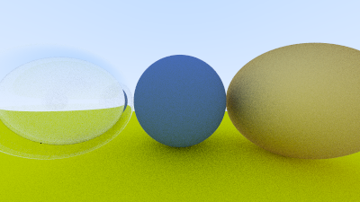
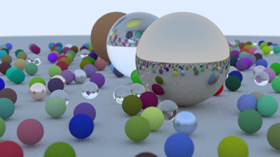
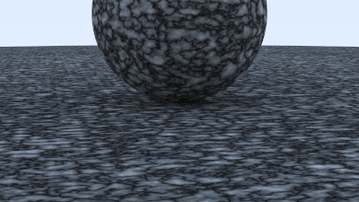
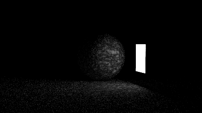
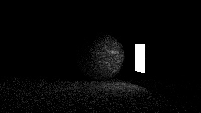
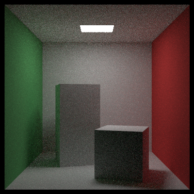
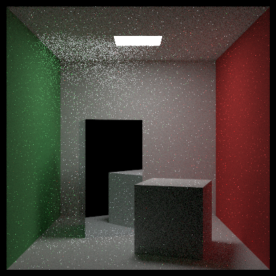
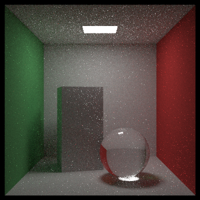

# raytracing-in-one-weekend

This repo contains an implementation of a path-tracer as described in the RayTracing in One Weekend book series

## Features

The path-tracer is a single-core path-tracer that can render scene described objects described by their geometries, materials and textures. It additionaly features importance sampling for scene where lights are also specified.

Path-tracer geometry types:
- Primitives: Sphere, Quads
- Volumes : ConstantMedium
- Instancing: Translate, RotateY
- Accelerating structures: BVH

Path-tracer material types:
- Lambertian
- Metal
- Dielectric
- Diffuse Light (lights)
- Isotropic (volume)

Path-tracer Texture types
- SolidColorTexture
- CheckerBoardTexture
- NoiseTexture (perlin noise)
- ImageTexture

Path-tracer Camera types
- PinholeCamera
- LensCamera (Depth-of-Field)

## Galery

| Image | Description |
| ----- | ----------- |
|  | RTIOW scene: Lambertian, Metal and Dielectric materials showcase |
|  | RTIOW cover image |
|  | RTTNW scene: Perlin noise showcase |
|  | RTTNW scene: Lighting showcase |
|  | RTTNW scene: Cornell Box |
|  | RTTROYL scene: Cornell Box with lights |
|  | RTTROYL scene: Cornell Box with metallic surface |
|  | RTTROYL scene: Cornell Box with sphere geometry |

## Further notes

As this project is a learning experience, there are some features that are not present which would be quite desirable:
- Hardware acceleration (multithread/GPU)
- Triangle geometry
- Scene import
- Mid-render visualisation

## References

- [_Ray Tracing in One Weekend_](https://raytracing.github.io/books/RayTracingInOneWeekend.html)
- [_Ray Tracing: The Next Week_](https://raytracing.github.io/books/RayTracingTheNextWeek.html)
- [_Ray Tracing: The Rest of Your Life_](https://raytracing.github.io/books/RayTracingTheRestOfYourLife.html)